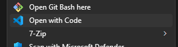

# Guide til at sætte kode-miljøet op

## Download VS Code

https://code.visualstudio.com/

Hent *Live Server*-udvidelsen til VS Code, fra udvidelses-menuen.

## Hent koden

Gå til https://git.sfja.dk/sfja/game-in-js og download koden som ZIP-fil.


Find ZIP-mappen på computeren og udpak ZIP-mappen's filer. Vælg for eksempel at lægge filerne på Desktop/Skrivebordet.


Herefter åben den ny-udpakkede mappe i VS Code.



## Start Live Server

Tryk på "Go Live" i bunden til højre i VS Code og åben http://localhost:5500/ i en web-browser som Chrome eller Firefox.

## Tegn en firkant

Åben filen `game.js`. Dette er allerede i filen:

```js
import * as lib from "./lib/lib.js"

function loop() {
    lib.canvas.fillRect(100, 100, 200, 50, "red");
}

lib.startGame(loop);
```

Tilføj en linje i `loop`-funktionen:
```js
function loop() {
    // ...
    lib.canvas.fillRect(100, 200, 50, 50, "lightblue");
}
```

Der burde nu være 2 firkanter på skærmen.


