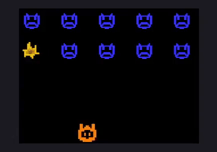
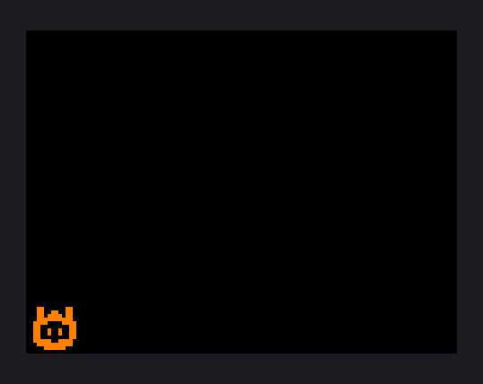

# Guide til at lave et Space Invaders-spil

Denne guide viser dig, hvordan du kan lave en Space Invaders-spil.



I Space Invaders er man et rumskip, er kan bevæge sig fra side til side. Man kigger op ad mod himlen.

Oppe i himlen nærmer der sig nogle rumskibe. Dem skal man forsøge at skyde ned.

## 1 Opsætning

Følg [Opsætningsguiden](setup_danish.md) og start med denne kode.

```js
import * as lib from "./lib/lib.js"

function loop() {
    lib.canvas.fillRect(100, 100, 200, 50, "red");
}

lib.startGame(loop);
```

Den første import-linje henter kode-biblioteket, `lib` er en forkortelse for *library*.

Funktionen `loop` er et stykke kode, der bliver kørt hver frame (dvs. det bliver kørt igen og igen).

Linjen `lib.canvas.fillRect(100, 100, 200, 50, "red")` tegner en rød firkant på skærmen, med kordinaterne `(x: 100, y: 100)` og størrelsen `(width: 200, height: 50)`.

## 2 Tegn spilleren

Hent spiller-sprite'en.
```js
const playerSprite = await lib.texture.loadImage("assets/player.png", 64, 64);
```

Giv spriten'en en orange farve.
```js
playerSprite.adjustColor(1, 0.5, 0);
```
`(1, 0.5, 0)` betyder 100% rød, 50% grøn og 0% blå.

Lav en variabel til spillerens x-position.
```js
let playerX = 0;
```

Tegn spilleren ved at erstatte koden i `loop` med:
```js
function loop() {
    const cx = lib.canvas;
    
    cx.clear("black");
    cx.putTexture(playerSprite, playerX, 300);
}
```

Der burde nu være en orange spiller på skærmen.



## 3 Kontroller spillerens bevægelse

Spilleren skal kunne flytte sig fra side til side med piletasterne.

Tilføj en konstant med spillerens fart.
```js
const playerSpeed = 300;
```

Tilføj en funktion til at opdatere spiller-bevægelse.
```js
function loop() {
    updatePlayerMovement();
    // ...
}

function updatePlayerMovement() {

}
```
`// ...` betyder resten af koden fra før.

Find ud af om piletasterne (← og →) bliver trykket ned.
```js
function updatePlayerMovement() {
    const goLeft = lib.isPressed("ArrowLeft");
    const goRight = lib.isPressed("ArrowRight");
}
```

Lav en if-statement, som tjekker, om spilleren skal til højre eller venstre.
```js
function updatePlayerMovement() {
    // ...

    if (goLeft && !goRight) {
        // player should go left

    } else if (goRight && !goLeft) {
        // player should go right

    }
}
```

Flyt spilleren, hvis spilleren skal flytte.
```js
function updatePlayerMovement() {
    // ...

    if (goLeft && !goRight) {
        // player should go left
        playerX -= playerSpeed * lib.frameDeltaT;

    } else if (goRight && !goLeft) {
        // player should go right
        playerX += playerSpeed * lib.frameDeltaT;

    }
}
```

Hvis spilleren går for langt til venstre eller for langt til højre, skal spilleren blive ved kanten. Tjek og spilleren går ud af banen og flyt spilleren tilbage.
```js
function updatePlayerMovement() {
    // ...

    if (goLeft && !goRight) {
        // ...
        
        if (playerX < 0) {
            playerX = 0;
        }
    } else if (goRight && !goLeft) {
        // ...

        if (playerX >= lib.canvas.width - playerSprite.width) {
            playerX = lib.canvas.width - playerSprite.width;
        }
    }
}
```

Spilleren burde nu kunne flytte sig fra side til side på skærmen. (Sørg for at canvas'en er i focus).

## 4 Skyd

Spilleren skal kunne affyre skud ved at trykke på mellemrumstasten. Et skud bliver affyret fra spillerens rumskip og flyver opad.

Importer skud-sprite'en.
```js
const bulletSprite = await lib.texture.loadImage("assets/bullet1.png", 24, 24);
```

Roter sprite'en 180° (det samme som 1 × π i [radianer](https://da.wikipedia.org/wiki/Radian)).
```js
bulletSprite.rotate(Math.PI);
```

Lav en konstant for skud-hastighed.
```js
const bulletSpeed = 400;
```

Lav en variable med et tomt array af skud.
```js
let bullets = [];
```

Lav en cooldown-timer til skud med en konstant og en variabel.
```js
const bulletCoolDown = 0.5;

// the first shot should not have cooldown
let bulletCooldownTimer = bulletCoolDown;
```

Lav en *event handler* til når man trykker mellemrum.
```js
lib.onPress(" ", () => {
});
```

Lav timer-håndteringen.
```js
function loop() {
    bulletCooldownTimer += lib.frameDeltaT;

    // ..
}

lib.onPress(" ", () => {
    if (bulletCooldownTimer >= bulletCoolDown) {
        bulletCooldownTimer = 0;
    }
});
```

Tilføj et skud til `bullets`-array'et. Skuddet *spawner* ved spillerens position.
```js
lib.onPress(" ", () => {
    if (bulletCooldownTimer >= bulletCoolDown) {
        // ...

        bullets.push({ x: playerX + 20, y: 300 });
    }
});
```

Tilføj en funktion til at opdatere skud.
```js
function loop() {
    // ...
    updateBulletMovement();
    // ...
}

function updateBulletMovement() {
}
```

Loop igennem `bullets`-array'et.
```js
function updateBulletMovement() {
    for (const bullet of bullets) {
    }
}
```

Flyt hvert skud.
```js
function updateBulletMovement() {
    for (const bullet of bullets) {
        bullet.y -= bulletSpeed * lib.frameDeltaT;
    }
}
```

Tegn hvert skud med et loop.
```js
function loop() {
    // ...

    for (const bullet of bullets) {
        cx.putTexture(bulletSprite, bullet.x, bullet.y);
    }
}
```

Spilleren burde nu kunne skyde ved at trykke på mellemrumstasten. Skuddene burde starte ved spilleren og flyve opad.

## 5 Fjender

Spilleren spiller mod fjender, som er rumskibe der kommer oppefra. Der er flere rækker fjender, som spilleren skal skyde ned.

Hent fjende-sprite'en og giv den en blå farve.
```js
const enemySprite = await  lib.texture.loadImage("assets/enemy1.png", 48, 48);

enemySprite.adjustColor(0.2, 0.2, 1);
```

Lav et `enemies`-array.
```js
let enemies = [];
```

Lav en funktion til at spawne fjender.
```js
function loop() {
    // ...
    if (enemies.length === 0) {
        spawnEnemies();
    }
    // ...
}

function spawnEnemies() {
}
```

Loop igennem en 2d-plan med rækker og kolonner.
```js
function spawnEnemies() {
    const rows = 2;
    const columns = 5;

    for (let y = 0; y < rows; ++y) {
        for (let x = 0; x < columns; ++x) {
        }
    }
}
```

Spawn en fjende for hvert position i 2d-planet.
```js
function spawnEnemies() {
    // ...
    for (let y = 0; y < rows; ++y) {
        for (let x = 0; x < columns; ++x) {

            enemies.push({
                x: x * 100 + 10,
                y: y * 80 + 10,
            });
        }
    }
}
```

Tegn fjenderne i `enemies`-array'et.
```js
function loop() {
    // ...
    for (const enemy of enemies) {
        cx.putTexture(enemySprite, enemy.x, enemy.y);
    }
}
```

## 6 Skyd fjender

Når en spiller skyder et skud og skuddet rammer en fjende, så "dør" fjenden, hvilket betyder at fjenden forsvinder. Skuddet skal også selv forsvinde.

Tilføj en funktion til at håndtere skud-kollisioner.
```js
function loop() {
    // ...
    handleBulletCollisions();
    // ...
}

function handleBulletCollisions() {
}
```

Man kan tjekke om 2 rektangler overlapper hinanden med en matematisk formel. Lav en funktion til at tjekke rektangel-kollision.
```js
function rectsAreColliding(
    aX, aY, aWidth, aHeight,
    bX, bY, bWidth, bHeight,
) {
    return aX < bX + bWidth
        && aX + aWidth >= bX
        && aY < bY + bHeight
        && aY + aHeight >= bY;
}
```

I `handleBulletCollisions`, lav 2 arrays til døde fjender og døde skud.
```js
function handleBulletCollisions() {
    let deadEnemies = [];
    let deadBullets = [];
}
```

Lav et loop, der løber igennem hver fjende, med fjenden's *index* i `enemies`-array'et
```js
function handleBulletCollisions() {
    //...
    for (let enemyIdx = 0; enemyIdx < enemies.length; ++enemyIdx) {

        const enemy = enemies[enemyIdx];
    }
}
```

Inde i dette loop, lav et nyt loop, der løber igennem alle skud i `bullets`-array'et.
```js
function handleBulletCollisions() {
    //...
    for (let enemyIdx = 0; enemyIdx < enemies.length; ++enemyIdx) {
        //...
        for (let bulletIdx = 0; bulletIdx < bullets.length; ++bulletIdx) {

            const bullet = bullets[bulletIdx];
        }
    }
}
```

Inde i det inderste loop, tjek om et skud kollidere med en fjende.
```js
function handleBulletCollisions() {
    //...
    for (let enemyIdx = 0; enemyIdx < enemies.length; ++enemyIdx) {
        //...
        for (let bulletIdx = 0; bulletIdx < bullets.length; ++bulletIdx) {
            //...
            const isColliding = rectsAreColliding(
                bullet.x, bullet.y, 24, 24,
                enemy.x, enemy.y, 48, 48,
            );
            if (isColliding) {
            }
        }
    }
}
```

Hvis de kollidere, gem *index* for skuddet og fjenden.
```js
function handleBulletCollisions() {
    //...
    for (let enemyIdx = 0; enemyIdx < enemies.length; ++enemyIdx) {
        //...
        for (let bulletIdx = 0; bulletIdx < bullets.length; ++bulletIdx) {
            //...
            if (isColliding) {
                deadBullets.push(bulletIdx);
                deadEnemies.push(enemyIdx);
            }
        }
    }
}
```

Til sidst, fjern alle døde skud og fjender fra `bullets`- og `enemies`-array'ene.
```js
function handleBulletCollisions() {
    //...
    for (const i of deadEnemies.toReversed()) {
        enemies.splice(i, 1)
    }
    for (const i of deadBullets.toReversed()) {
        bullets.splice(i, 1)
    }
}
```

Nu burde fjender kunne skydes, så de forsvinder fra skærmen. Skuddet der rammer fjenden, burde også blive fjernet. Når alle fjender er skudt, bliver nye fjender spawnet.

## 7 Animer eksplisioner

Når man rammer en fjende, skal fjenden eksplodere med en animation.

Hent eksplosions-sprites og giv dem en gul-agtig farve.
```js
const explosionSprites = [
    await lib.texture.loadImage(`assets/explosion1.png`, 64, 64),
    await lib.texture.loadImage(`assets/explosion2.png`, 64, 64),
    await lib.texture.loadImage(`assets/explosion3.png`, 64, 64),
    await lib.texture.loadImage(`assets/explosion4.png`, 64, 64),
];

for (const texture of explosionSprites) {
    texture.adjustColor(1, 0.75, 0);
}
```

Lav en variabel med et `explosions`-array og en konstant med varigheden af animationen.
```js
const explosionDuration = 0.5;

let explosions = [];
```

Når en fjende bliver ramt, skal der spawnes en eksplosion. I `handleBulletCollisions`-funktionen, tilføj en eksplosion, når der sker en kollision.
```js
function handleBulletCollisions() {
    // ...
    for (let enemyIdx = 0; enemyIdx < enemies.length; ++enemyIdx) {
        // ...
        for (let bulletIdx = 0; bulletIdx < bullets.length; ++bulletIdx) {
            // ...
            if (isColliding) {
                // ...
                explosions.push({
                    x: enemy.x + 24,
                    y: enemy.y + 24,
                    time: 0,
                });
            }
        }
    }
    // ...
}
```

Lav en `updateExplosions`-funktion til at opdatere eksplosioner.
```js
function loop() {
    // ...
    updateExplosions();
    // ...
}

function updateExplosions() {
}
```

Lav et array til eksplosioner, som er blevet færdige i dens animation.
```js
function updateExplosions() {
    let deadExplosions = [];
}
```

Lav et loop, der løber igennem hvert *index* i  `explosion`-array'et.
```js
function updateExplosions() {
    let deadExplosions = [];

    for (let i = 0; i < explosions.length; ++i) {
        const explosion = explosions[i];
    }
}
```

Håndter animationens timer.
```js
function updateExplosions() {
    // ...
    for (let i = 0; i < explosions.length; ++i) {
        // ...
        explosion.time += lib.frameDeltaT;
    }
}
```

Tilføj eksplosionen til `deadExplosions`-array'et, hvis timeren er udløbet.
```js
function updateExplosions() {
    // ...
    for (let i = 0; i < explosions.length; ++i) {
        // ...
        if (explosion.time > explosionDuration) {
            deadExplosions.push(i);
        }
    }
}
```

Fjern *døde* eksplosioner.
```js
function updateExplosions() {
    // ...
    for (const i of deadExplosions.toReversed()) {
        explosions.splice(i, 1)
    }
}
```

Til sidst, tegn eksplosionerne.
```js
function loop() {
    // ...
    for (const explosion of explosions) {

        // goes from 0.0 to 1.0
        const animationFraction = explosion.time / explosionDuration;

        // goes from 0.0 to 4.0
        const spriteIdxFraction = animationFraction * explosionSprites.length;

        // is either of 0, 1, 2 or 3
        const spriteIdx = Math.floor(spriteIdxFraction);

        const texture = explosionSprites[spriteIdx];

        cx.putTexture(texture, explosion.x - 32, explosion.y - 32);
    }
}
```

Nu burde der være eksplosions-animationer, når en fjende bliver skudt.

